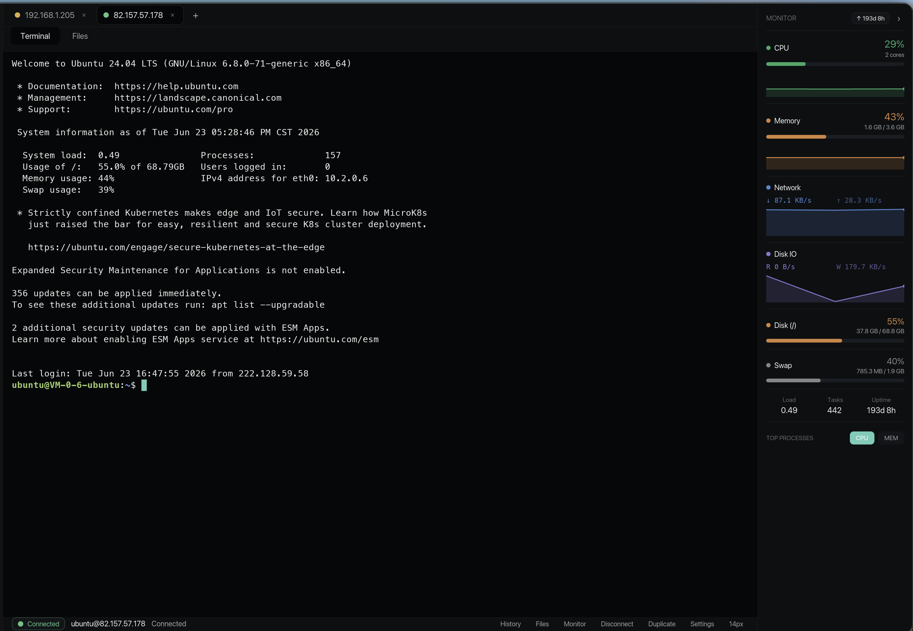
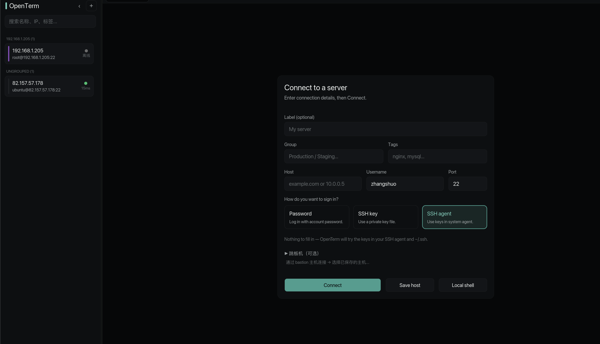
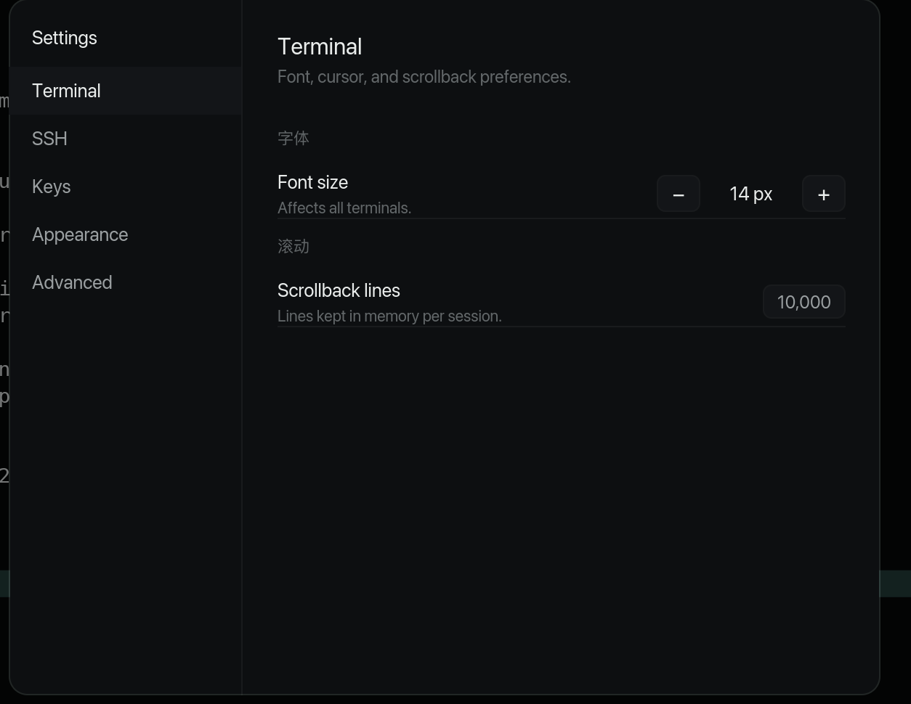
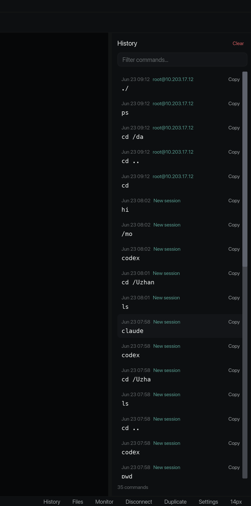

# OpenTerm

> An offline-first, locally-encrypted SSH desktop workbench written in pure Rust. No account. No cloud. Just terminals.

[](https://www.rust-lang.org/)
[](LICENSE)
[](crates/)

---



## Why OpenTerm

OpenTerm is an open-source alternative to commercial SSH clients like Termius. It gives you
a full-featured terminal workspace without requiring a login, uploading your secrets to the
cloud, or running a Chromium shell.

- **Offline-first** — everything runs locally, no network dependency to start
- **No account** — no sign-up, no telemetry, no SaaS lock-in
- **Encrypted vault** — passwords and private keys encrypted at rest with Argon2id + ChaCha20Poly1305
- **Auditable** — pure Rust, small dependency tree, zero hidden binaries

## Features

### Terminal



- Full PTY shell via [russh](https://github.com/warp-tech/russh)
- Horizontal session tabs for multiple simultaneous connections
- Scrollback, search, copy/paste, bracket paste
- Font-size-aware PTY sizing with automatic resize on window change
- CJK / IME input support
- Dark and light themes

### Host Management
- Host sidebar with search by name, address, username, or initials
- Host groups for organizing servers
- Fingerprint verification with confirm-new-known_hosts flow

### Authentication
- Password authentication
- Private key authentication (OpenSSH format)
- SSH agent integration
- Default key fallback

### File Transfer
- Dual-pane SFTP workspace (local + remote)



- Upload, download, mkdir, rename, and delete workflows
- Local and remote directory browsing

### Port Forwarding
- Local port forwarding (`-L`)
- Remote port forwarding (`-R`)
- Dynamic SOCKS5 forwarding (`-D`)

### Jump Hosts
- Bastion / jump host routing
- Chained SSH connections through intermediate servers

### Vault & Security
- Encrypted local vault for secrets (Argon2id + ChaCha20Poly1305)
- Passwords never stored in plaintext on disk
- Auto-lock vault on inactivity
- Zero telemetry, zero analytics

### Import & Export
- Import hosts from `~/.ssh/config`
- Export host profiles as TOML
- Export host profiles as JSON

### Keyboard-Driven
- Command Palette (`Ctrl/Cmd + K`) for all actions
- Terminal copy (`Ctrl/Cmd + Shift + C`)
- Terminal paste (`Ctrl/Cmd + Shift + V`)
- Terminal clear (`Ctrl/Cmd + Shift + L`)
- Right-click context menu with search, copy, paste, and clear



## Installation

### From Source

```sh
git clone git@github.com:zhangshuo1991/openterm.git
cd openterm
cargo build --release -p openterm-app
./target/release/openterm-app
```

**Requirements:** Rust 1.82+, macOS (Linux and Windows planned)

### Pre-built Binaries

Download the latest DMG from the [Releases](https://github.com/zhangshuo1991/openterm/releases) page.

## Quick Start

```sh
# Launch the GUI
cargo run -p openterm-app

# Use the CLI
cargo run -p openterm-cli -- list-hosts
cargo run -p openterm-cli -- add-host myserver 192.168.1.100 --user admin
cargo run -p openterm-cli -- exec myserver "hostname" --user admin --password-stdin
```

Use `New` in the Hosts sidebar to add a server, fill in the connection details, then click
**Connect** from the session bar above the terminal. Select `SFTP` in the tab bar to open
the dual-pane file transfer workspace for the current host.

Hit `Ctrl/Cmd + K` to open the command palette and access forwarding, diagnostics, settings,
and host actions without clutter.

## Architecture

```
┌─────────────────────────────────────────────────┐
│  openterm-app                 (iced Desktop GUI) │
│  ┌──────────┐ ┌──────────┐ ┌──────────────────┐ │
│  │ Sidebar  │ │   Tabs   │ │ Terminal (PTY)   │ │
│  │ (Hosts)  │ │(Sessions)│ │ alacritty_terminal│ │
│  └──────────┘ └──────────┘ └──────────────────┘ │
│  ┌──────────┐ ┌──────────┐ ┌──────────────────┐ │
│  │  SFTP    │ │ Command  │ │    Settings      │ │
│  │(dual-pane)│ │ Palette  │ │                  │ │
│  └──────────┘ └──────────┘ └──────────────────┘ │
├─────────────────────────────────────────────────┤
│  openterm-ui           (UI state management)     │
├─────────────────────────────────────────────────┤
│  ┌─────────────────┐ ┌─────────────────────────┐│
│  │ openterm-ssh    │ │ openterm-terminal       ││
│  │ russh client    │ │ alacritty_terminal grid ││
│  │ PTY, SFTP, fwd  │ │ scrollback, selection   ││
│  └─────────────────┘ └─────────────────────────┘│
│  ┌─────────────────┐ ┌─────────────────────────┐│
│  │openterm-storage │ │ openterm-crypto         ││
│  │ redb database   │ │ argon2 + chacha20poly   ││
│  │ schema, migrate │ │ zeroize, vault          ││
│  └─────────────────┘ └─────────────────────────┘│
│  ┌─────────────────┐ ┌─────────────────────────┐│
│  │openterm-config  │ │ openterm-core           ││
│  │ SSH config io   │ │ domain models, events   ││
│  │ TOML/JSON export│ │ validation, contracts   ││
│  └─────────────────┘ └─────────────────────────┘│
└─────────────────────────────────────────────────┘
```

| Crate | Purpose |
|-------|---------|
| `openterm-app` | iced desktop GUI, app shell, layout, subscriptions |
| `openterm-cli` | Command-line tool for scripting and debugging |
| `openterm-core` | Domain models, validation, event bus, commands |
| `openterm-crypto` | Vault encryption (Argon2id + ChaCha20Poly1305 + zeroize) |
| `openterm-storage` | redb-backed local persistence, schema, migrations |
| `openterm-config` | OpenSSH `~/.ssh/config` import, TOML/JSON export |
| `openterm-ssh` | SSH transport (russh), PTY, SFTP, tunnels, jump hosts |
| `openterm-terminal` | Terminal buffer engine (alacritty_terminal) |
| `openterm-ui` | UI state management and product shell logic |

Dependencies flow one way: `ui → core ← ssh / storage / crypto / terminal / config`.
SSH and terminal crates expose interfaces for future adapter swaps; UI depends on domain
contracts, not SSH internals.

## Development

```sh
# Format all code
cargo fmt --all

# Type-check the workspace
cargo check --workspace

# Run all unit and doc tests
cargo test --workspace

# Launch the app
cargo run -p openterm-app

# Build optimized release binary
cargo build --release -p openterm-app
```

### Smoke Tests (Real SSH)

A test SSH server at `82.157.57.178` is used for integration testing. Password must be
supplied via environment variable or stdin:

```sh
./scripts/test_ui_smoke_real.sh          # GUI launch + screenshot
./scripts/test_ui_real_connect.sh        # Connect via GUI PTY
./scripts/test_ui_real_resize.sh         # PTY resize verification
./scripts/test_ui_real_duplicate_connect.sh  # Duplicate tab connect
./scripts/test_ui_real_sftp.sh           # SFTP remote directory listing
./scripts/test_ui_real_forward.sh        # Local port forward
./scripts/test_ui_settings_persistence.sh # Settings survive restart
./scripts/test_all_real.sh               # Full chain
```

For storage tests that should not touch the default database:

```sh
cargo test --workspace -- --skip real
```

Use `--db /path/to/test.redb` for storage tests with an isolated database.

## Tech Stack

| Component | Library |
|-----------|---------|
| GUI | [iced](https://iced.rs/) — pure Rust, GPU-accelerated |
| SSH | [russh](https://github.com/warp-tech/russh) — async SSH |
| Terminal | [alacritty_terminal](https://github.com/alacritty/alacritty) — GPU-accelerated emulator |
| Storage | [redb](https://github.com/cberner/redb) — pure Rust embedded DB |
| Crypto | argon2 + chacha20poly1305 + zeroize |
| Async | [tokio](https://tokio.rs/) |
| CLI | [clap](https://docs.rs/clap/) |
| File dialog | [rfd](https://github.com/PolyMeilex/rfd) |

## Security

See [SECURITY.md](SECURITY.md) for our security policy.

- No account or cloud connectivity required
- Secrets encrypted at rest (Argon2id + ChaCha20Poly1305)
- Passwords never logged or exposed in plaintext
- known_hosts key verification
- Zero telemetry or analytics

To report a vulnerability, please use private disclosure — do not file a public issue.

## Roadmap

Current status: **P3 — Terminal Polish**

| Phase | Goal |
|-------|------|
| P0 | Technical validation — iced + russh + alacritty integration |
| P1 | Minimal offline SSH client — host CRUD, auth, multi-tab, persistence |
| P2 | Vault, import/export, SFTP, port forwarding, jump hosts |
| P3 | Terminal polish — scrollback, search, themes, shortcuts, CJK |
| P4 | Split panes, batch ops, agent integration, dynamic SOCKS |
| P5 | Self-hosted sync, plugin API, session recording |
| P6 | Release — packaging, signing, auto-update, documentation |

See [ROADMAP.md](ROADMAP.md) and [product.md](product.md) for full details.

## Contributing

Contributions are welcome! See [CONTRIBUTING.md](CONTRIBUTING.md) for guidelines.

- Keep changes aligned with `product.md`
- Preserve offline-first behavior
- Keep SSH, terminal, storage, and UI concerns separated
- Do not add cloud dependencies to the base client
- Add tests for storage, crypto, import/export, and connection state changes

## License

Licensed under either of [MIT License](LICENSE-MIT) or [Apache License 2.0](LICENSE-APACHE) at your option.

---

**OpenTerm** — the SSH client you own.
